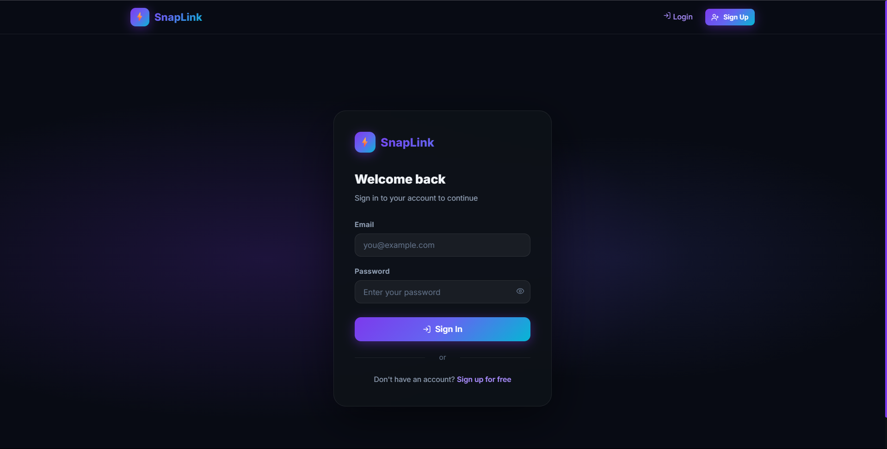
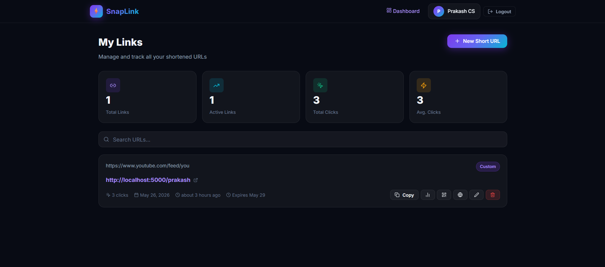
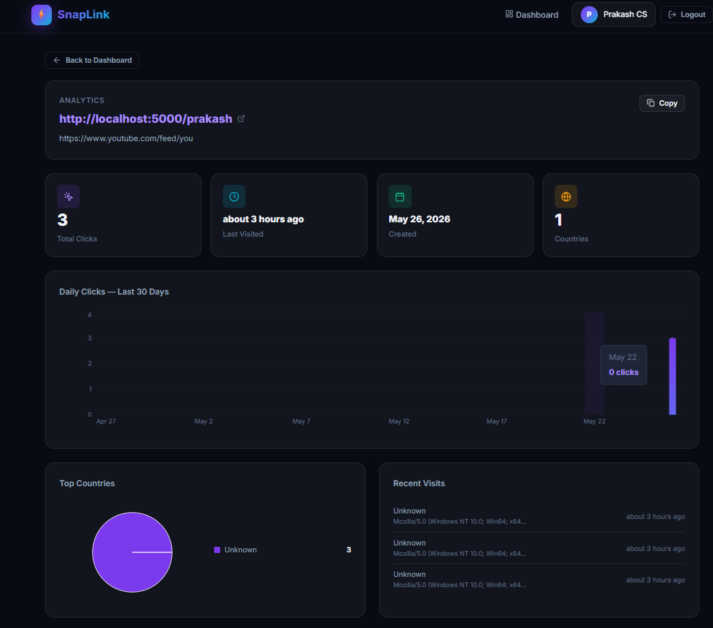
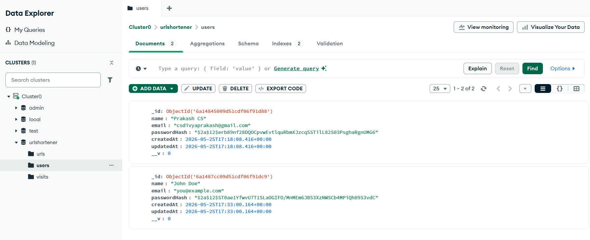
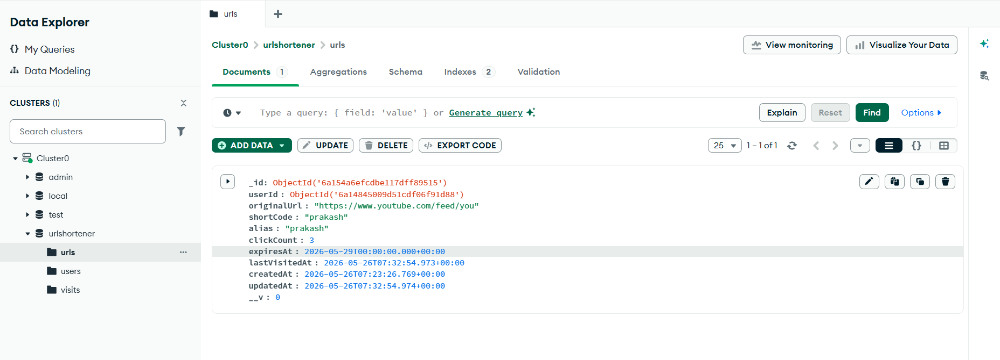
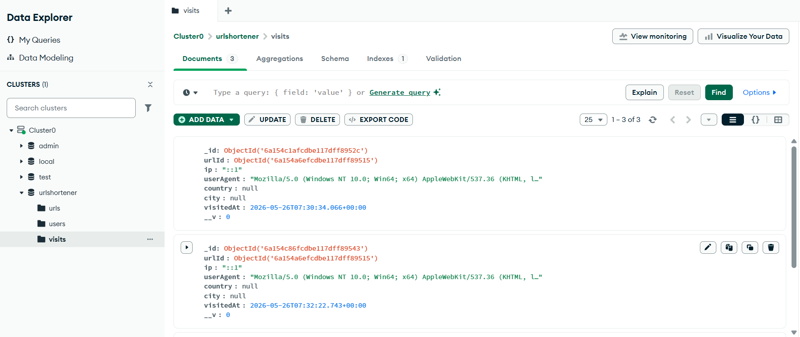

# SnapLink — URL Shortener with Analytics

> This project is a part of a hackathon run by https://katomaran.com

A full-stack URL shortener with real-time analytics, custom aliases, QR codes, and more. Built for the **Katomaran Hackathon (May 2026)**.

---

## 🎥 Demo Video

[](https://youtu.be/q86kn1i2kJY)

▶️ **https://youtu.be/q86kn1i2kJY**

---

## 📸 Screenshots

### Landing Page


### Dashboard


### Analytics


### QR Code


---

## 🗄️ Database Entries (MongoDB Atlas)

### Users Collection


### URLs Collection


### Visits Collection


---

## 🏗️ Architecture Diagram

```
┌─────────────────────────────────────────────┐
│                  BROWSER                     │
│  React (Vite) SPA                           │
│  ─ Auth pages (Login / Signup)              │
│  ─ Dashboard (manage short URLs)            │
│  ─ Analytics page (charts + visit log)      │
│  ─ Public Stats page (no auth)              │
└──────────────┬──────────────────────────────┘
               │ REST API (Axios + JWT)
               ▼
┌─────────────────────────────────────────────┐
│         Node.js + Express Server            │
│                                             │
│  POST  /api/auth/register                   │
│  POST  /api/auth/login                      │
│  GET   /api/auth/me                         │
│  POST  /api/urls          (create)          │
│  GET   /api/urls          (list own URLs)   │
│  DELETE /api/urls/:id                       │
│  PATCH  /api/urls/:id     (edit dest)       │
│  GET   /api/urls/:id/analytics              │
│  GET   /api/urls/:code/public-stats         │
│  GET   /:shortCode        (redirect + log)  │
│                                             │
│  Middleware: JWT auth, rate limiting,       │
│  Helmet, CORS, error handler                │
└──────────────┬──────────────────────────────┘
               │ Mongoose ODM
               ▼
┌─────────────────────────────────────────────┐
│                 MongoDB Atlas                │
│  users   — auth credentials (bcrypt hashed)│
│  urls    — short URLs, click count, expiry  │
│  visits  — per-click analytics records      │
└─────────────────────────────────────────────┘
```

---

## ✅ Features

### Mandatory
- ✅ User signup and login (bcrypt + JWT)
- ✅ Protected dashboard routes
- ✅ Each user manages only their own URLs
- ✅ URL shortening with unique 7-char codes (nanoid)
- ✅ Server-side 302 redirect
- ✅ URL validation before shortening
- ✅ Dashboard: view all URLs with original/short/date/clicks
- ✅ Delete URLs
- ✅ Copy short URL to clipboard
- ✅ Click count tracking
- ✅ Visit timestamps recorded
- ✅ Analytics page: total clicks, last visited, recent visit history

### Bonus
- ✅ Custom aliases for short URLs
- ✅ QR code generation (downloadable PNG)
- ✅ Expiry date for links
- ✅ Daily click trend chart (Recharts BarChart — last 30 days)
- ✅ Edit destination URL
- ✅ Public stats page (`/stats/:shortCode`) — no login required
- ✅ Geolocation analytics (country/city via ip-api.com)
- ✅ Country breakdown pie chart

---

## 🛠️ Tech Stack

| Layer | Technology |
|---|---|
| Frontend | React 18 + Vite |
| Styling | Vanilla CSS (custom dark mode design system) |
| Backend | Node.js + Express |
| Database | MongoDB Atlas + Mongoose |
| Auth | JWT + bcryptjs |
| Short codes | nanoid |
| URL validation | validator.js |
| Charts | recharts |
| QR codes | qrcode.react |
| HTTP client | Axios |
| Icons | lucide-react |
| Dates | date-fns |

---

## ⚙️ Setup Instructions

### Prerequisites
- Node.js 18+
- MongoDB Atlas account (free tier works)

### 1. Clone the repo
```bash
git clone https://github.com/csdivyaprakash-netizen/snaplink-url-shortener.git
cd snaplink-url-shortener
```

### 2. Backend Setup
```bash
cd backend
npm install
cp .env.example .env
# Edit .env with your MongoDB URI and JWT secret
npm run dev
```

### 3. Frontend Setup
```bash
cd frontend
npm install
npm run dev
```

- Frontend: `http://localhost:5173`
- Backend: `http://localhost:5000`

---

## 📋 Environment Variables

### Backend `.env`
```
PORT=5000
MONGO_URI=mongodb+srv://<user>:<password>@cluster0.xxxxx.mongodb.net/urlshortener
JWT_SECRET=your_super_secret_jwt_key
BASE_URL=http://localhost:5000
CLIENT_URL=http://localhost:5173
```

### Frontend `.env`
```
VITE_API_URL=http://localhost:5000
VITE_BASE_URL=http://localhost:5000
```

---

## 🤔 Assumptions Made

1. Short URLs use the **backend server** as the base URL (e.g., `http://localhost:5000/abc1234`) since the redirect must be server-side.
2. Geolocation is done via the free `ip-api.com` API — best effort, failures are silently ignored.
3. Passwords must be ≥ 6 characters. No password recovery flow (out of scope).
4. Analytics data is stored indefinitely (no auto-purge).
5. `nanoid` v3 is used for CommonJS compatibility with `require()`.

---

## 🧠 AI Planning Document

### Tools Used
- **Antigravity (AI agent by Google DeepMind)** — used for full application planning and code generation

### Planning Steps
1. Read and analyzed the hackathon problem statement
2. Designed architecture diagram and MongoDB schema
3. Planned all API endpoints, middleware stack, and folder structure
4. Generated backend: models (User, Url, Visit), controllers, routes, middleware
5. Generated frontend: design system, all pages, components, API client
6. Integrated JWT auth, React Router, Axios interceptors
7. Added all bonus features: QR codes, charts, expiry, geolocation, public stats
8. Wrote full README documentation

---

## 📁 Project Structure

```
url-shortener/
├── backend/
│   └── src/
│       ├── config/       → db.js
│       ├── models/       → User.js, Url.js, Visit.js
│       ├── controllers/  → authController.js, urlController.js
│       ├── routes/       → auth.js, urls.js, redirect.js
│       ├── middleware/   → auth.js, errorHandler.js
│       └── index.js      → Express entry point
├── frontend/
│   └── src/
│       ├── api/          → axios.js, auth.js, urls.js
│       ├── components/   → Navbar, UrlCard, QRModal
│       ├── context/      → AuthContext.jsx
│       ├── pages/        → Landing, Login, Signup, Dashboard, Analytics, PublicStats
│       └── index.css     → Full design system
├── screenshots/          → App & DB screenshots
└── README.md
```

---

> This project is a part of a hackathon run by https://katomaran.com
